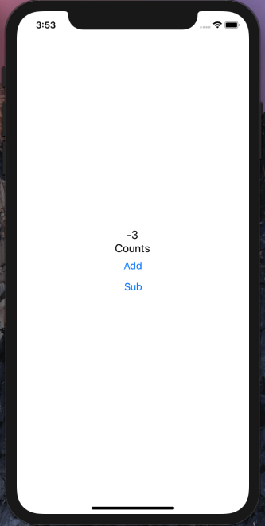
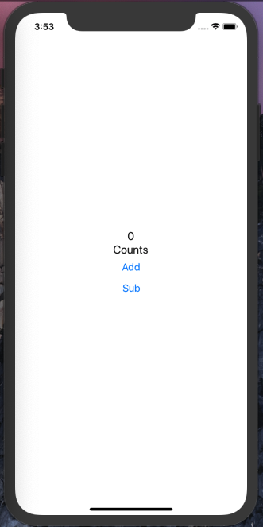
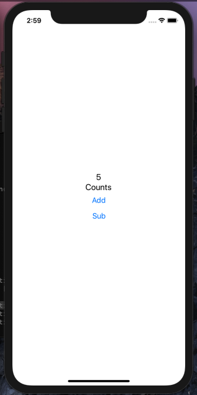

# Redux learning demo app

| sub button click                 | inital state 0               | add button click                 |
| -------------------------------- | ---------------------------- | -------------------------------- |
|  |  |  |
